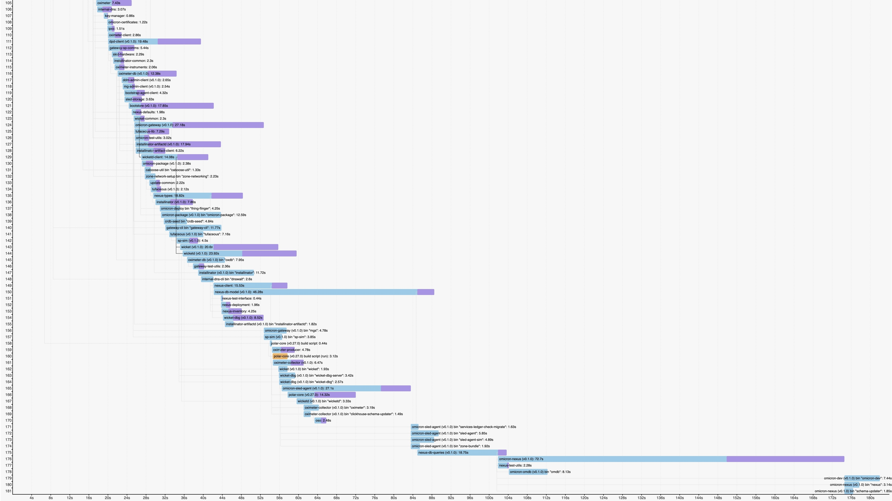
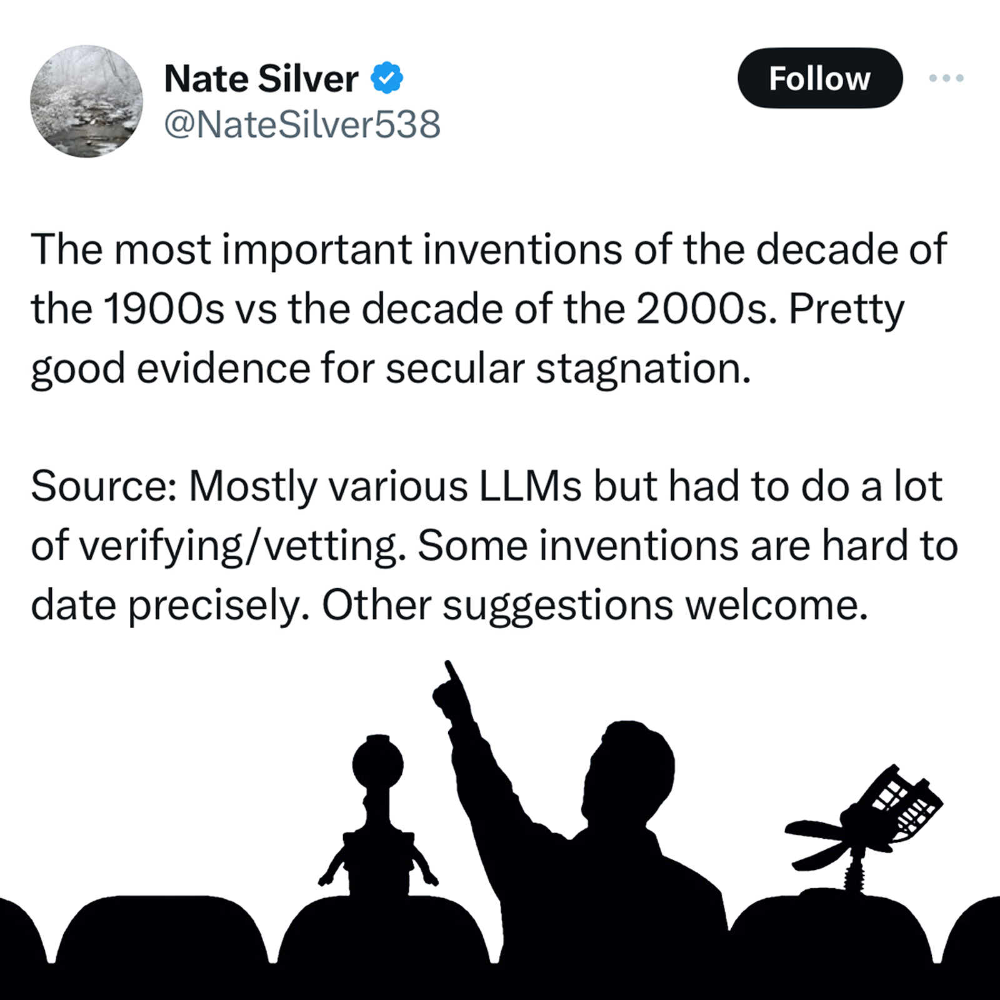

[Bryan](https://bcantrill.dtrace.org) and I just wrapped up [season 4](/2024/01/13/oxide-and-friends-season-4/) of [Oxide and Friends](https://oxide-and-friends.transistor.fm/). Borrowing from [The Changelog](https://changelog.com/), we capped the season with a look back on the past year of episodes. While the Changelog folks pick their favorite titles, we had more to say about our favorite cover images. Below I've summarized our year in images. Click on the left for YouTube, and the right for the podcast (with links to various podcast platforms).

We record most Mondays on the [Oxide Discord server](https://discord.gg/gcQxNHAKCB); join us live to chime in or just heckle us in chat.

<table class="oxf-image-table">
  <th>
    

      

        YouTube
      

      

        Podcast
      

    

  </th>
  <tr>
    <td>
      

        <strong>Episode 1:</strong> Predictions 2024!
      

    </td>
  </tr>
  <tr>
    <td>
      

        

          

            
          

        

        

          

            
          

        

      

    </td>
  </tr>
  <tr>
    <td colspan="2">
      

        <strong>Episode 2:</strong> Open Source LLMs with Simon Willison
      

    </td>
  </tr>
  <tr>
    <td>
      

        

          

            
          

        

        

          

            
          

        

      

    </td>
  </tr>
  <tr>
    <td colspan="2">
      

        <strong>Episode 3:</strong> What's taking so long?!
      

    </td>
  </tr>
  <tr>
    <td>
      

        

          

            
          

        

        

          

            
          

        

      

    </td>
  </tr>
  <tr>
    <td colspan="2">
      

        <strong>Episode 4:</strong> Helios
      

    </td>
  </tr>
  <tr>
    <td>
      

        

          

            
          

        

        

          

            
          

        

      

    </td>
  </tr>
  <tr>
    <td colspan="2">
      

        <strong>Episode 5:</strong> Innovation Stagnation?
      

    </td>
  </tr>
  <tr>
    <td>
      

        

          

            
          

        

        

          

            
          

        

      

    </td>
  </tr>
  <tr>
    <td colspan="2">
      

        <strong>Episode 6:</strong> Crucible: The Oxide Storage Service
      

    </td>
  </tr>
  <tr>
    <td>
      

        

          

            
          

        

        

          

            
          

        

      

    </td>
  </tr>
  <tr>
    <td colspan="2">
      

        <strong>Episode 7:</strong> Data Visualization
      

    </td>
  </tr>
  <tr>
    <td>
      

        

          

            
          

        

        

          

            
          

        

      

    </td>
  </tr>
  <tr>
    <td colspan="2">
      

        <strong>Episode 8:</strong> Adversarial Machine Learning
      

    </td>
  </tr>
  <tr>
    <td>
      

        

          

            
          

        

        

          

            
          

        

      

    </td>
  </tr>
  <tr>
    <td colspan="2">
      

        <strong>Episode 9:</strong> Cultural Idiosyncrasies
      

    </td>
  </tr>
  <tr>
    <td>
      

        

          

            
          

        

        

          

            
          

        

      

    </td>
  </tr>
  <tr>
    <td colspan="2">
      

        <strong>Episode 10:</strong> Discovering the XZ Backdoor with Andres Freund
      

    </td>
  </tr>
  <tr>
    <td>
      

        

          

            
          

        

        

          

            
          

        

      

    </td>
  </tr>
  <tr>
    <td colspan="2">
      

        <strong>Episode 11:</strong> A Baseball Startup with Paul Freedman and Bryan Carmel
      

    </td>
  </tr>
  <tr>
    <td>
      

        

          

            
          

        

        

          

            
          

        

      

    </td>
  </tr>
  <tr>
    <td colspan="2">
      

        <strong>Episode 12:</strong> All we have to fear is FUD itself
      

    </td>
  </tr>
  <tr>
    <td>
      

        

          

            
          

        

        

          

            
          

        

      

    </td>
  </tr>
  <tr>
    <td colspan="2">
      

        <strong>Episode 13:</strong> Bookclub: How Life Works by Philip Ball
      

    </td>
  </tr>
  <tr>
    <td>
      

        

          

            
          

        

        

          

            
          

        

      

    </td>
  </tr>
  <tr>
    <td colspan="2">
      

        <strong>Episode 14:</strong> Rebooting a datacenter: A decade later
      

    </td>
  </tr>
  <tr>
    <td>
      

        

          

            
          

        

        

          

            
          

        

      

    </td>
  </tr>
  <tr>
    <td colspan="2">
      

        <strong>Episode 15:</strong> Musing with Changelog's Adam Stacoviak
      

    </td>
  </tr>
  <tr>
    <td>
      

        

          

            
          

        

        

          

            
          

        

      

    </td>
  </tr>
  <tr>
    <td colspan="2">
      

        <strong>Episode 16:</strong> Is NVIDIA like Sun from the Dot Com Bubble?
      

    </td>
  </tr>
  <tr>
    <td>
      

        

          

            
          

        

        

          

            
          

        

      

    </td>
  </tr>
  <tr>
    <td colspan="2">
      

        <strong>Episode 17:</strong> Innovation Tokens with Charity Majors
      

    </td>
  </tr>
  <tr>
    <td>
      

        

          

            
          

        

        

          

            
          

        

      

    </td>
  </tr>
  <tr>
    <td colspan="2">
      

        <strong>Episode 18:</strong> Heterogeneous Computing with Raja Koduri
      

    </td>
  </tr>
  <tr>
    <td>
      

        

          

            
          

        

        

          

            
          

        

      

    </td>
  </tr>
  <tr>
    <td colspan="2">
      

        <strong>Episode 19:</strong> CrowdStrike BSOD Fiasco with Katie Moussouris
      

    </td>
  </tr>
  <tr>
    <td>
      

        

          

            
          

        

        

          

            
          

        

      

    </td>
  </tr>
  <tr>
    <td colspan="2">
      

        <strong>Episode 20:</strong> Pragmatic LLM usage with Nicholas Carlini
      

    </td>
  </tr>
  <tr>
    <td>
      

        

          

            
          

        

        

          

            
          

        

      

    </td>
  </tr>
  <tr>
    <td colspan="2">
      

        <strong>Episode 21:</strong> The Saga of Sagas
      

    </td>
  </tr>
  <tr>
    <td>
      

        

          

            
          

        

        

          

            
          

        

      

    </td>
  </tr>
  <tr>
    <td colspan="2">
      

        <strong>Episode 22:</strong> Whither CochroachDB?
      

    </td>
  </tr>
  <tr>
    <td>
      

        

          

            
          

        

        

          

            
          

        

      

    </td>
  </tr>
  <tr>
    <td colspan="2">
      

        <strong>Episode 23:</strong> RFDs: The Backbone of Oxide
      

    </td>
  </tr>
  <tr>
    <td>
      

        

          

            
          

        

        

          

            
          

        

      

    </td>
  </tr>
  <tr>
    <td colspan="2">
      

        <strong>Episode 24:</strong> Reflecting on Founder Mode
      

    </td>
  </tr>
  <tr>
    <td>
      

        

          

            
          

        

        

          

            
          

        

      

    </td>
  </tr>
  <tr>
    <td colspan="2">
      

        <strong>Episode 25:</strong> RTO or GTFO
      

    </td>
  </tr>
  <tr>
    <td>
      

        

          

            
          

        

        

          

            
          

        

      

    </td>
  </tr>
  <tr>
    <td colspan="2">
      

        <strong>Episode 26:</strong> Querying Metrics with OxQL
      

    </td>
  </tr>
  <tr>
    <td>
      

        

          

            
          

        

        

          

            
          

        

      

    </td>
  </tr>
  <tr>
    <td colspan="2">
      

        <strong>Episode 27:</strong> Unshrouding Turin (or Benvenuto a Torino)
      

    </td>
  </tr>
  <tr>
    <td>
      

        

          

            
          

        

        

          

            
          

        

      

    </td>
  </tr>
  <tr>
    <td colspan="2">
      

        <strong>Episode 28:</strong> Books in the Box IV
      

    </td>
  </tr>
  <tr>
    <td>
      

        

          

            
          

        

        

          

            
          

        

      

    </td>
  </tr>
  <tr>
    <td colspan="2">
      

        <strong>Episode 29:</strong> Technical Blogging
      

    </td>
  </tr>
  <tr>
    <td>
      

        

          

            
          

        

        

          

            
          

        

      

    </td>
  </tr>
  <tr>
    <td colspan="2">
      

        <strong>Episode 30:</strong> Intel after Gelsinger
      

    </td>
  </tr>
  <tr>
    <td>
      

        

          

            
          

        

        

          

            
          

        

      

    </td>
  </tr>
  <tr>
    <td colspan="2">
      

        <strong>Episode 31:</strong> Conferences in Tech
      

    </td>
  </tr>
  <tr>
    <td>
      

        

          

            
          

        

        

          

            
          

        

      

    </td>
  </tr>
  <tr>
    <td colspan="2">
      

        <strong>Episode 32:</strong> Scaling Bluesky with Paul Frazee
      

    </td>
  </tr>
  <tr>
    <td>
      

        

          

            
          

        

        

          

            
          

        

      

    </td>
  </tr>
  <tr>
    <td colspan="2">
      

        <strong>Episode 33:</strong> OxF 2024 Wrap-Up
      

    </td>
  </tr>
  <tr>
    <td>
      

        

          

            
          

        

        

          

            
          

        

      

    </td>
  </tr>
</table>
